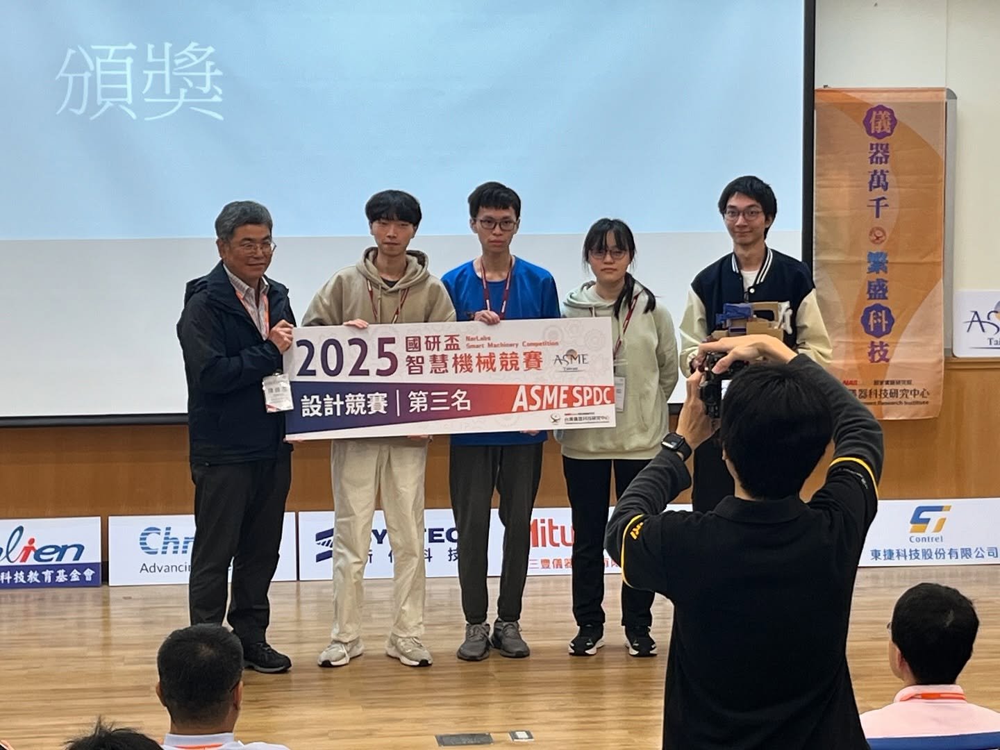

# 2025 iTron
# 近況報告

---

## 社團核心價值

成為一個讓對機器人有興趣的人參與競賽的平台，
並且將課堂上學到的知識應用在實作中

---

## 社團目標

達成目標需要的三個任務

1. 招生
2. 教學
3. 競賽

---

## 1. 招生

- 成員的數量有增加的趨勢
- 開學後前幾週內有新生說明會

###### 其他待補

---

## 2. 教學

- 2025.4.21辦理講座
  《Solidworks進階實作與商用技巧》
- iTron 第一次尋找講師辦理講座
- 未來會尋找更多講師

---

## 2. 教學

**教學大綱**

| 學期 | 內容 |
| --- | --- |
| 上學期 | <ul><li><b>課程內容</b>：以橡皮筋槍車為主題，並舉辦期末競賽。<li><b>目標</b>：讓新生接觸機構及程式並，熟悉專案製作流程。</ul> |
| 下學期 | <ul><li><b>課程內容</b>：分為機構及程式組，並提供各組專門課程 （e.g. 程式組 ROS 教學）。<li><b>目標</b>：培養新生具備機器人設計製作的實戰能力，為參與TDK準備。</ul> |

###### 如果有更細的大綱會更好發揮
###### 與前幾年的教學相比，改進了什麼?

---

## 3. 比賽

**Kibo-RPC競賽 (Kibo Robot 
Programming Challenge)**

- iTron 第一次參加 Kibo-RPC 競賽
- 台灣區預賽第一
- 於 11 月前往日本 JAXA 
  筑波太空中心參加決賽

---

## 3. 比賽

**Kibo-RPC競賽 (Kibo Robot 
Programming Challenge)**

- 第一次在此規模的比賽奪冠
  全台77支隊伍
- 與上次iTron奪冠
  (2021年領航杯)相比，
  當時參加隊伍僅有個位數

---

## 3. 比賽

**ASME國研盃智慧機械競賽**

- 第三名
- 參賽歷史:
  - 2024: 參與
  - 2023: 第三名
  - 2022: 佳作
- 今年的主題對我們較為陌生，
  因此在機構設計上比較不熟練

---

## 3. 比賽

**TDK盃全國大專院校創思設計與製作競賽**

目前正在準備階段，於十月進行競賽

| 關卡 | 進度 |
| --- | --- |
| S型導航 | 7/28～8/4 |
| 狹橋走線 | 8/4～8/6 |
| 咖啡杯夾取 | 8/7～8/8 |
| 視覺辨識摘橘子 | 8/11～8/23 |

---

## 3. 比賽

**TDK盃全國大專院校創思設計與製作競賽**

S型導航

###### 我沒有影片權限

---

## 3. 比賽

**TDK盃全國大專院校創思設計與製作競賽**

狹橋走線

###### 我沒有影片權限

---

## 3. 比賽

**TDK盃全國大專院校創思設計與製作競賽**

咖啡杯夾取

###### 我沒有影片權限

---

## 3. 比賽

**TDK盃全國大專院校創思設計與製作競賽**

視覺辨識摘橘子

###### 我沒有影片權限

---

## 請益事項

- **招生**: 新學期將舉辦招生說明會，老師是否有機會一同參與？
  老師以教授角度說明「將系上課程融入實作」部分，可以讓招生更順利
- **教學**: 在第一次辦理與聆聽講座時，學到許多3D繪圖的技巧。
  請問教授有沒有認識其他講師願意和我們舉辦講座?
- **比賽**: 11月時有Kibo-RPC競賽的複賽。
  由於有模型需要訓練，請問教授有沒有知道一些GPU相關的資源?
  譬如計算機中心有GPU出借，可否請教授協助?或Google Colab上有無方案可以使用?

###### 不一定需要寫在投影片，可以在聊天的時候聊到